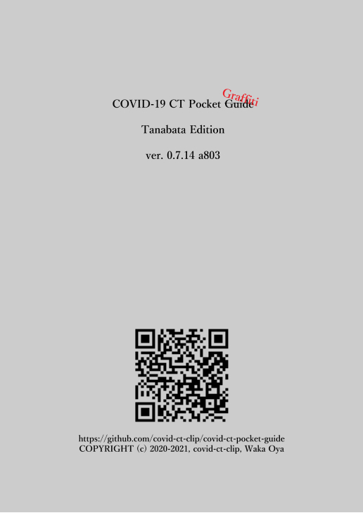

# covid-ct-pocket-~guide~graffiti
Illustrated COVID-19 CT Image classification ~guide~ graffiti (lang:Japanese)

---
# * *under construction* *
---

## 目標  
COVID-19の診療と診断に携わる(当院の最前線の)方々の  
緊急の要に供するための参考情報を提供すること。

## 注意  
*未検証の考察を多々含みます。*  
*エビデンスはありません*  
*施設によっては実態に適合しない可能性が高くなります  
 (特に軽症専用や重症専用の施設)*

---
## Tanabata版の追加/変更点(予定)
- CT重症度分類をイラストにより提示する  
　予後予測・診療方針の一助とすることを目標とする
- 進行リスクと治療方針が異なる細分化した仮の分類を提示する  
    中等症Ⅰ→ⅠA, ⅠB  
    中等症Ⅱ→ⅡA, ⅡB, ⅡC  
- COVID-19のすりガラス影の特徴
- 各分類の境界病変の見分け方
- 急速進行型を拾い上げるコツ
- 急性期後期から亜急性期に生じる陰影について  

## SAMPLE

